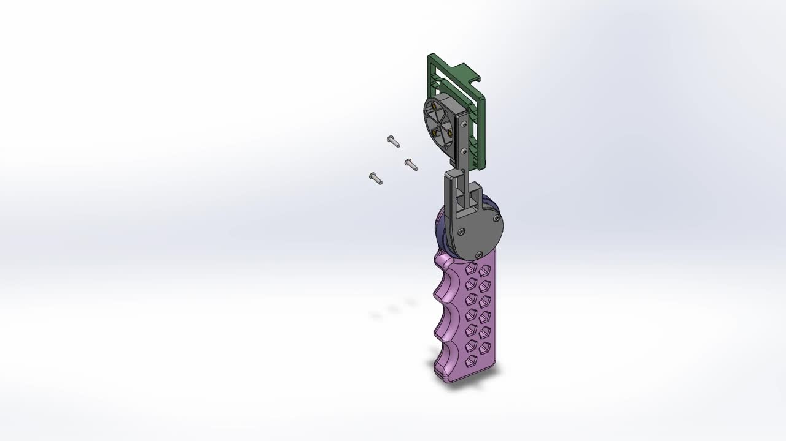
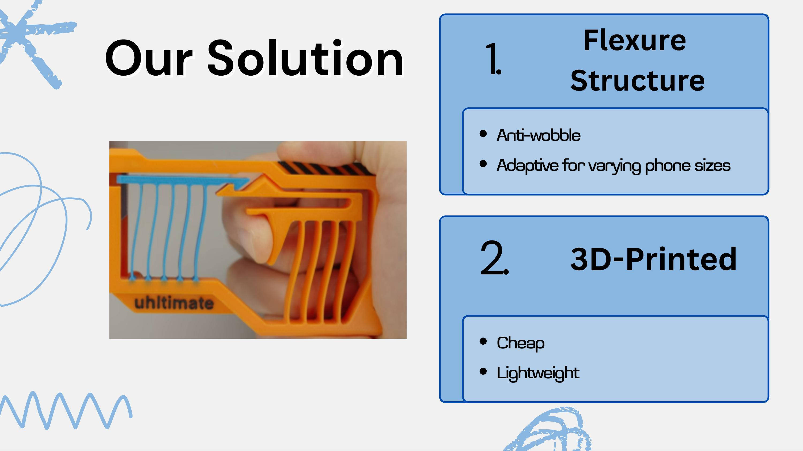
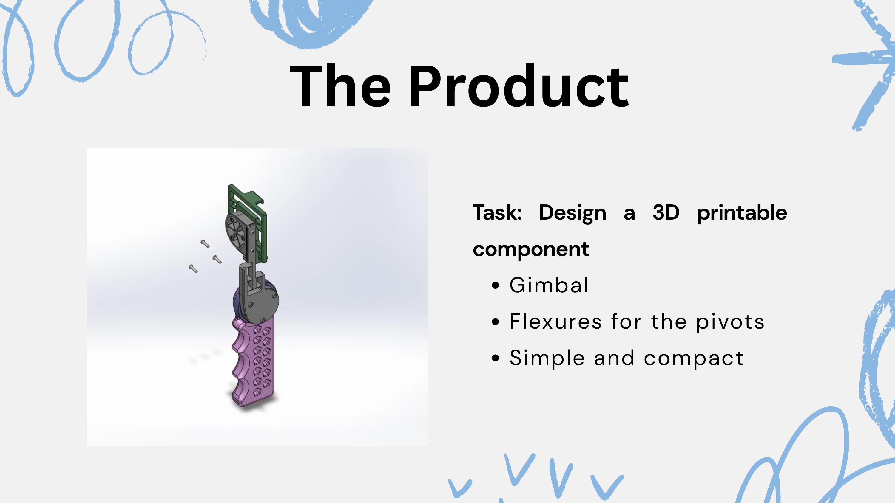
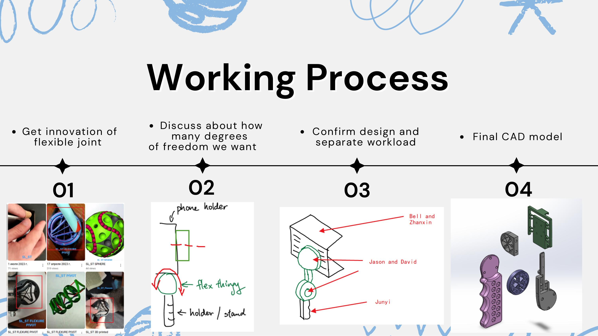
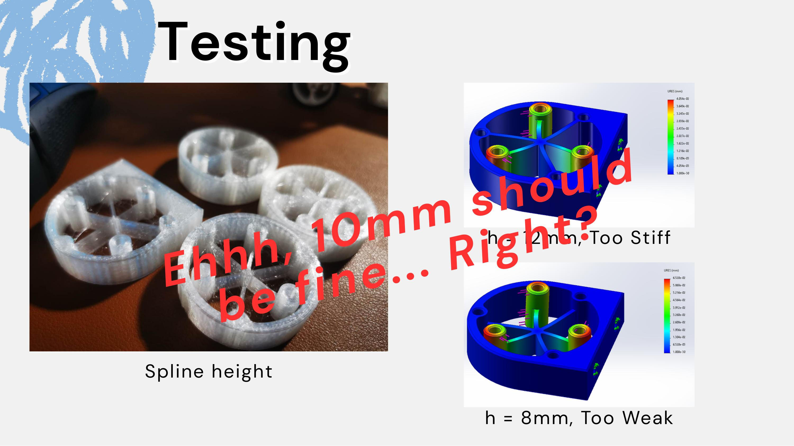
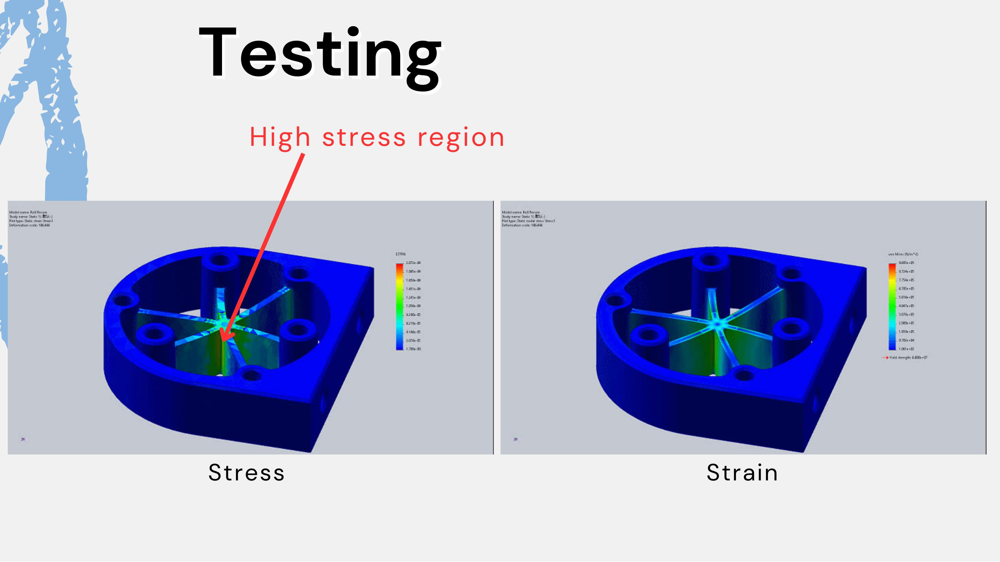
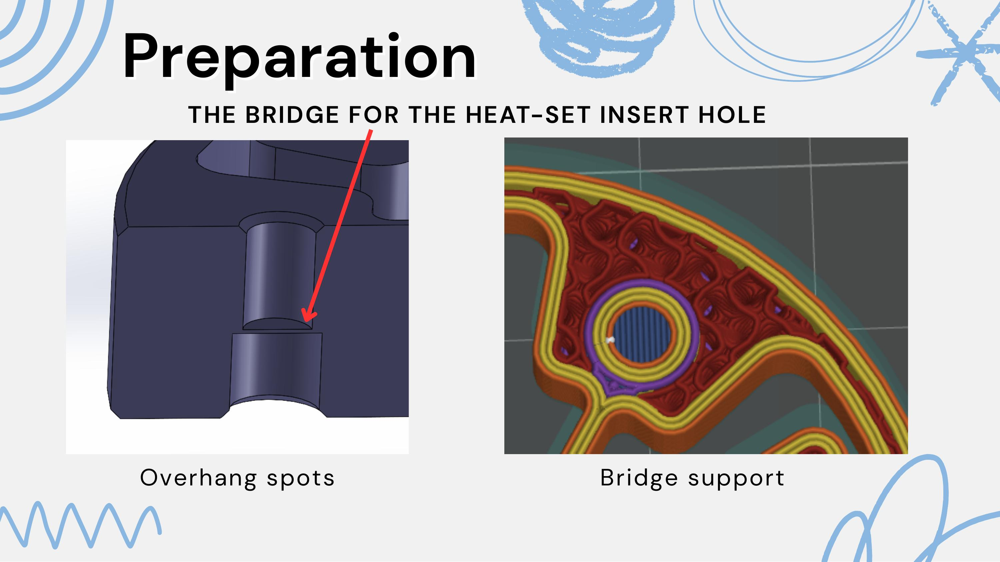
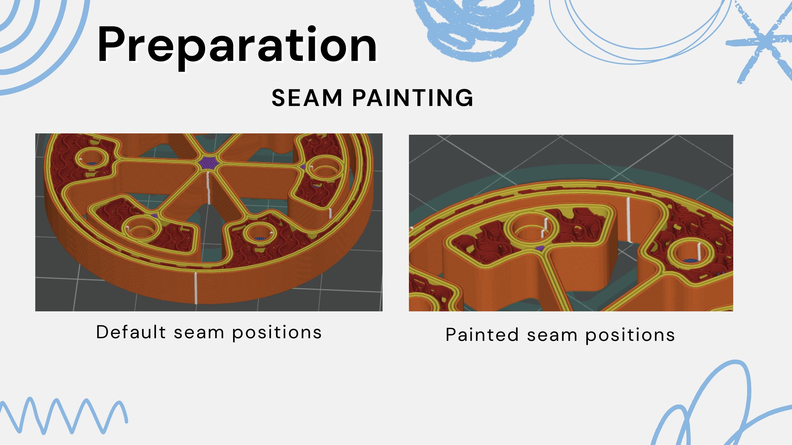

# MMAN4200 手机稳定器（柔性铰链云台）

新南威尔士大学增材制造设计课程（MMAN4200）小组项目

**团队成员：** David Dai、Zhanxin Ye、Jia Bei (Belinda) Wong、Junyi Wang、Chenyi Zhang (Jason Tomczyk)

## 项目背景

课程任务：设计一个可 3D 打印的机构部件。我们选择的方向是手机拍摄稳定器——市面上的解决方案要么是笨重昂贵的三脚架，要么是几十澳元起步的电动云台（如 DJI OSMO Mobile SE），普通用户很难低成本获得稳定的手持拍摄体验。

## 解决方案

核心思路是用**柔性铰链结构（Flexure Structure）**代替传统的轴承/关节，一体式 3D 打印成型：

- 无需装配轴承或额外五金件，天然消除机械间隙带来的"晃动"
- 柔性铰链本身具备一定弹性，可适配不同尺寸的手机重量分布
- 全 3D 打印，材料成本低、重量轻

## 设计任务

具体要设计的部件是一个云台（Gimbal），要求：
- 用柔性铰链实现俯仰/横滚方向的转动
- 结构简单紧凑，适合桌面级打印机一次成型

## 工作流程

这个项目由我提出并主导：

1. 调研已有的柔性关节 3D 打印设计方案
2. 与团队讨论确定手机稳定所需的自由度数量——最终定为 **3 个自由度**，刚好满足拍摄防抖需求
3. 确认总体设计方向后分配任务：手机夹持支架（Bell、Zhanxin）和底部手柄（Junyi）交给组员自由建模；中间的旋转柔性铰链部分，我通过FEA和实验结果制定了了弹簧片厚度、高度与螺丝孔位置等设计要求，由 David 完成详细建模
4. 整合各部分完成最终 CAD 模型

## 设计验证与迭代

柔性铰链的**弹簧片高度（spline height）**决定了铰链的弹性系数——我独立完成了有限元仿真并打印了多组测试样件（8mm / 10mm / 12mm）验证仿真结果，12mm 太硬、8mm 太软，最终确定 **10mm** 为平衡点，并把这组尺寸要求提给 David 完成该部件的详细建模。

进一步的应力/应变仿真定位到了铰链的高应力集中区域，这个结果直接指导了后续的打印工艺准备。

## 打印工艺细节

全部零件的 DFM（面向增材制造的设计优化）与切片设置由我一人完成：

- **热熔嵌件孔的桥接结构**：部件两侧都需要用热熔嵌件螺丝固定，但 3D 打印机无法直接在悬空处可靠打印外壁，因此设计了桥接支撑结构来解决这个悬垂打印问题
- **打印接缝走位（Seam Painting）**：默认的分层打印接缝位置可能落在机械受力薄弱点，手动把接缝重新定位到受力更小的区域

（PDF 里展示的只是其中一部分考量，实际做的 DFM 优化和切片参数调整比展示的更多。）

## 我的角色

- 项目发起人：提出这个项目方向，主导团队分工
- 独立完成关键尺寸（弹簧片高度等）的有限元仿真与打印测试迭代，验证并确定最终设计参数
- 将旋转柔性铰链部分的厚度、高度、螺丝孔位置等设计要求提给 David，由他完成该部件详细建模
- 独立完成全部零件的 DFM 优化与打印切片设置（桥接支撑、接缝走位等）
- 最终报告的文案由其他组员执笔，本人负责技术用词校对与整体方向把控
