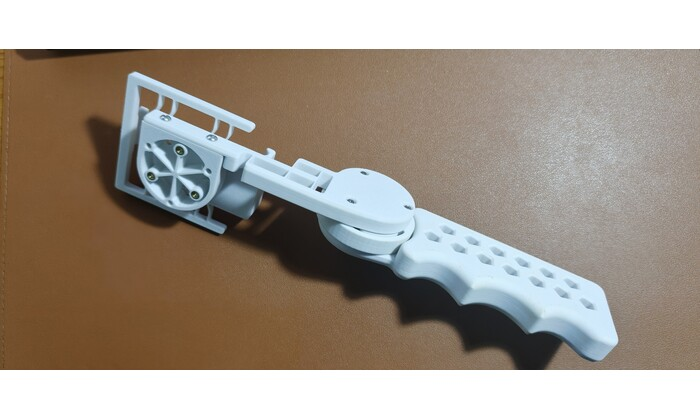
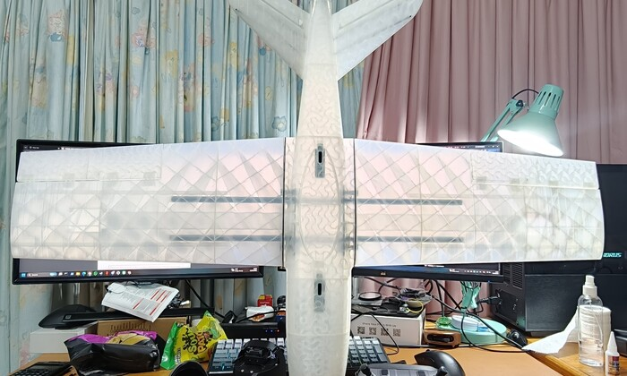
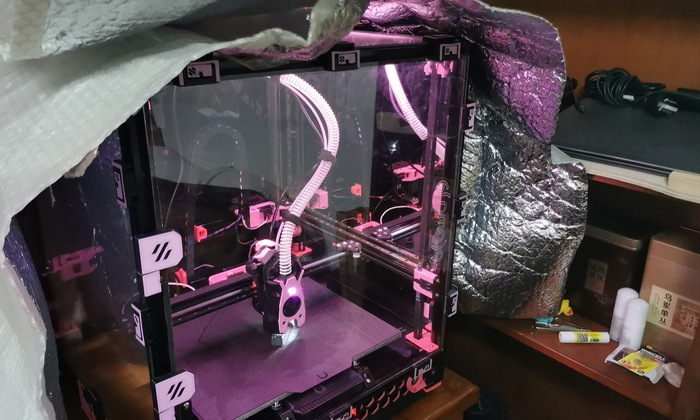
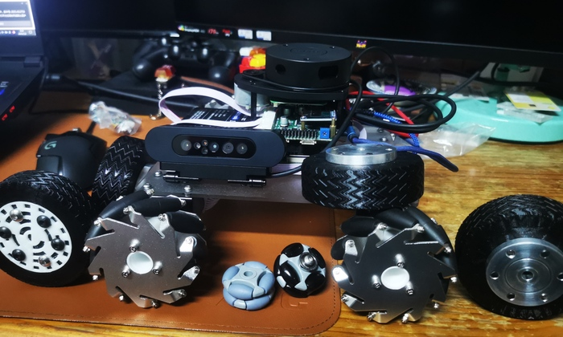
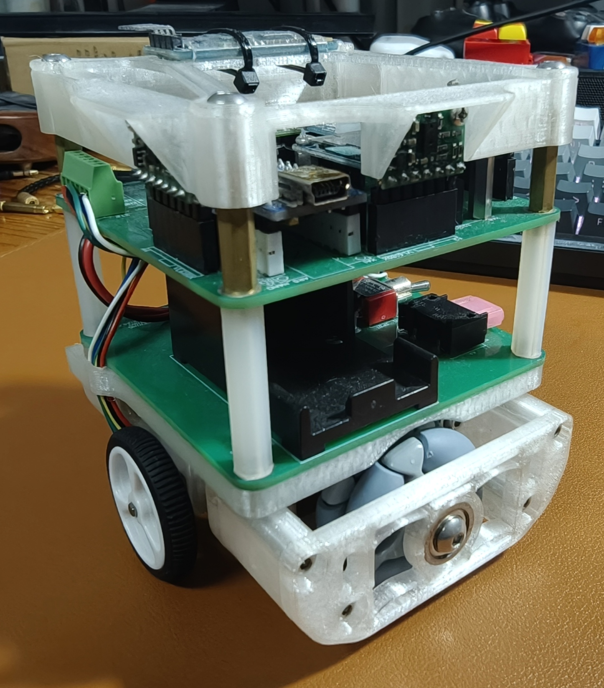
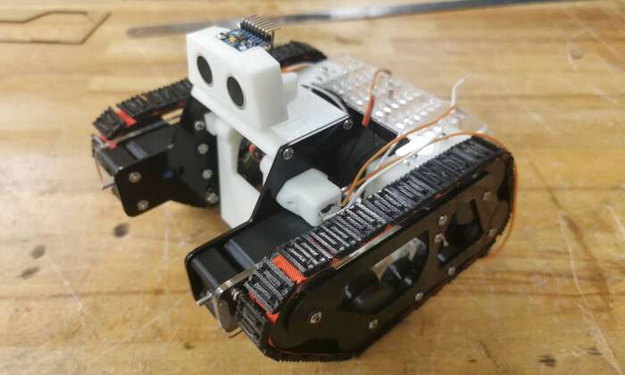
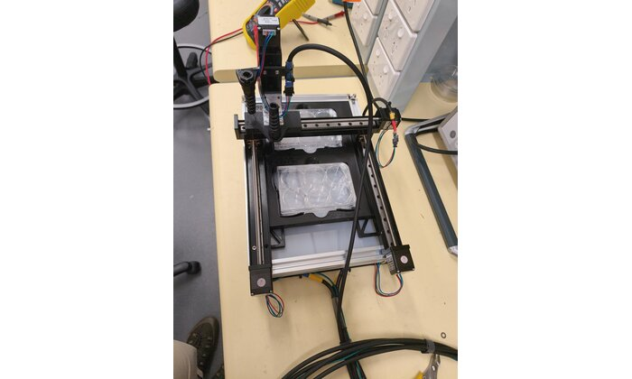

# Chenyi Zhang (Jason Tomczyk) — Project Portfolio

**机械设计与工艺导向工程师** · UNSW 机电一体化与机器人学 · [LinkedIn](https://www.linkedin.com/in/chenyi-zhang-607550284/)
**Mechanical Design & Process-Oriented Engineer** · UNSW Mechatronic Engineering & Robotics
**Mechanical Design & Process-Oriented Engineer** · UNSW Mechatronic Engineering & Robotics

从概念设计、三维建模到材料工艺、量产落地，这里整理了我的个人及团队项目。每个项目文件夹内都有完整的图片/视频记录和详细说明（中英双语）。
From concept design and 3D modelling to material process and production, this repo documents my personal and team projects. Each folder contains full photo/video records and detailed write-ups (bilingual CN/EN).

---

## 项目索引 / Project Index

### MMAN4200 手机稳定器（柔性铰链云台） · Phone Stabiliser
2024

**中文：** 增材制造设计课程小组项目，用柔性铰链结构代替传统轴承实现 3 自由度防抖云台。独立完成花键高度等关键尺寸的有限元仿真与打印测试迭代，并负责全部零件的 3D 打印 DFM 优化。
**关键词：** 柔性机构设计、FEA、3D打印DFM

**English:** Additive manufacturing design course group project — a 3-DOF anti-shake gimbal using flexure hinges instead of conventional bearings. Independently ran FEA and iterative print testing on key dimensions (e.g. spline height), and handled DFM optimisation for every printed part.
**Highlights:** Flexure mechanism design, FEA, 3D-print DFM

**详情 / Details:** [中文](<MMAN4200 Phone Stabiliser>/README_CN.md) | [English](<MMAN4200 Phone Stabiliser>/README_EN.md)

---

### Talon 1400 固定翼无人机 · Fixed-Wing UAV
2024-12 ~ 2025-01

**中文：** 基于开源固定翼机型 Flightory Talon 1400 改造，3D 打印发泡机身，搭载 SpeedyBee 飞控与 WalkSnail 图传。首飞坠毁后独立完成失效分析（油门过大→瞬时扭力过高→打印件剪切断裂），并提出油门曲线限制与局部密度强化的解决方案。
**关键词：** 结构失效分析、飞控调试、3D打印机身

**English:** Built from the open-source Flightory Talon 1400 fixed-wing kit — a 3D-printed foam fuselage fitted with a SpeedyBee flight controller and WalkSnail FPV system. After a crash on the maiden flight, independently diagnosed the failure (excessive throttle → torque spike → shear failure in the printed part) and fixed it with throttle-curve limiting plus localised infill reinforcement.
**Highlights:** Structural failure analysis, flight-controller tuning, 3D-printed fuselage

**详情 / Details:** [中文](<Talon 1400>/README_CN.md) | [English](<Talon 1400>/README_EN.md)

---

### Voron 2.4 3D 打印机 · "Pinky" CoreXY Printer
2023-07 ~ 2025

**中文：** 开源 CoreXY 打印机从零搭建，独立完成机架、电控、固件与运动调试全流程；后续升级为四驱（All-Wheel-Drive）架构，打印速度提升至 650mm/s。诊断并向厂商反馈了主板高频信号导致丢步的问题。
**关键词：** 机构搭建、故障诊断、四驱升级、振动补偿

**English:** Built an open-source CoreXY 3D printer from scratch — frame, electronics, firmware and motion tuning all done independently. Later upgraded to an all-wheel-drive (4-motor) configuration, raising print speed to 650mm/s. Diagnosed a mainboard high-frequency crosstalk issue causing missed steps and reported it to the manufacturer.
**Highlights:** Mechanical build, fault diagnosis, 4-motor upgrade, resonance compensation

**详情 / Details:** [中文](<Voron 2.4>/README_CN.md) | [English](<Voron 2.4>/README_EN.md)

---

### Wheeltech 自动驾驶平台 · Autonomous Ground Vehicle
2023-09 ~ 2025

**中文：** 麦克纳姆轮底盘概念验证项目，集成 RPLIDAR 与双目结构光相机做多传感器融合。这套轮组机械设计经验后来直接用在了 UNSW Bluesat ARC 月球车挑战赛的轮子设计上。
**关键词：** 传感器融合、麦克纳姆轮组机械设计

**English:** A Mecanum-wheel platform proof-of-concept integrating an RPLIDAR and a stereo structured-light camera for multi-sensor fusion. The wheel-mechanism design experience from this project was later applied directly to the wheel design for UNSW Bluesat's ARC lunar rover challenge.
**Highlights:** Sensor fusion, Mecanum wheel mechanical design

**详情 / Details:** [中文](<Wheeltech UGV>/README_CN.md) | [English](<Wheeltech UGV>/README_EN.md)

---

### MTRN3100 Micromouse 迷宫机器人
UNSW 大三课程项目 / Year 3 course project

**中文：** 机器人设计课程小组项目，设计并搭建走迷宫机器人。
**关键词：** 机械设计、故障排查

**English:** Robot design course group project — designing and building a maze-solving micromouse robot.
**Highlights:** Mechanical design, troubleshooting

**详情 / Details:** [中文](<MTRN3100 Micromouse>/README_CN.md) | [English](<MTRN3100 Micromouse>/README_EN.md)

---

### DESN1000 履带式搜救机器人 "Wall-F"
UNSW 大一课程项目，年级第一作品 / Year 1 course project, ranked #1 in cohort

**中文：** 大一工业设计与加工制造课程作品，履带式地形搜救机器人。用激光切割尼龙布+鱼线缝合 3D 打印履带板，把履带系统成本压到 5 澳元以内，是本课程历年最低成本方案。
**关键词：** 低成本机构设计、模块化、履带系统

**English:** First-year Industrial Design & Manufacturing course project — a tracked search-and-rescue robot. Hand-sewed 3D-printed track plates with laser-cut nylon fabric and fishing line, bringing the entire track system in under AUD 5 — the lowest-cost solution in the course's history.
**Highlights:** Low-cost mechanism design, modularity, tracked drive system

**详情 / Details:** [中文](<DESN1000 Robot to the Rescue>/README_CN.md) | [English](<DESN1000 Robot to the Rescue>/README_EN.md)

---

> **毕业设计** · 面向医学细胞团抓取与心跳检测的高精度直角坐标机器人，重复定位精度 0.01mm — 资料整理中，稍后补充。
> **Thesis project** · High-precision Cartesian robot for medical cell-aggregate grasping with simultaneous heartbeat detection, 0.01mm repeatability — write-up coming soon.
### MMAN4200 手机稳定器（柔性铰链云台） · Phone Stabiliser
2024

**中文：** 增材制造设计课程小组项目，用柔性铰链结构代替传统轴承实现 3 自由度防抖云台。独立完成弹簧片厚度等关键尺寸的有限元仿真与打印测试迭代，并负责全部零件的 3D 打印 DFM 优化。
**关键词：** 柔性机构设计、FEA、3D打印DFM

**English:** Additive manufacturing design course group project — a 3-DOF anti-shake gimbal using flexure hinges instead of conventional bearings. Independently ran FEA and iterative print testing on key dimensions (e.g. spline height), and handled DFM optimisation for every printed part.
**Highlights:** Flexure mechanism design, FEA, 3D-print DFM

**详情 / Details:** [中文](<MMAN4200 Phone Stabiliser>/README_CN.md) | [English](<MMAN4200 Phone Stabiliser>/README_EN.md)

---

### Talon 1400 固定翼无人机 · Fixed-Wing UAV
2024-12 ~ 2025-01

**中文：** 基于开源固定翼机型 Flightory Talon 1400 改造，3D 打印发泡机身，搭载 SpeedyBee 飞控与 WalkSnail 图传。首飞坠毁后独立完成失效分析（油门过大→瞬时扭力过高→打印件剪切断裂），并提出油门曲线限制与局部填充密度强化的解决方案，同时探索实用复合材料的可能性。
**关键词：** 结构失效分析、飞控调试、3D打印机身

**English:** Built from the open-source Flightory Talon 1400 fixed-wing kit — a 3D-printed foam fuselage fitted with a SpeedyBee flight controller and WalkSnail FPV system. After a crash on the maiden flight, independently diagnosed the failure (excessive throttle → torque spike → shear failure in the printed part) and fixed it with throttle-curve limiting plus localised infill reinforcement, along with exploring the possible use of composite materials.
**Highlights:** Structural failure analysis, flight-controller tuning, 3D-printed fuselage

**详情 / Details:** [中文](<Talon 1400>/README_CN.md) | [English](<Talon 1400>/README_EN.md)

---

### Voron 2.4 3D 打印机 · "Pinky" CoreXY Printer
2023-07 ~ 2025

**中文：** 从零搭建开源 CoreXY 打印机，独立完成机架、电控、固件与运动调试全流程；后续升级为四驱（All-Wheel-Drive）架构，打印速度提升至 1000mm/s。诊断并向厂商反馈了主板高频信号导致丢步的问题。
**关键词：** 机构搭建、故障诊断、振动补偿

**English:** Built an open-source CoreXY 3D printer from scratch — frame, electronics, firmware and motion tuning all done independently. Later upgraded to an all-wheel-drive (4-motor) configuration, raising print speed to 1000mm/s. Diagnosed a mainboard high-frequency crosstalk issue causing missed steps and reported it to the manufacturer.
**Highlights:** Mechanical build, fault diagnosis, resonance compensation

**详情 / Details:** [中文](<Voron 2.4>/README_CN.md) | [English](<Voron 2.4>/README_EN.md)

---

### Wheeltech 自动驾驶平台 · Autonomous Ground Vehicle
2023-09 ~ 2025

**中文：** 麦克纳姆轮底盘概念验证项目，集成 RPLIDAR 与双目结构光相机做多传感器融合。后期研发纯TPU打印的柔性轮胎，这套轮组机械设计经验后来直接用在了 UNSW Bluesat ARC 月球车挑战赛的轮子设计上。
**关键词：** 传感器融合、增料加工轮组设计

**English:** A Mecanum-wheel platform proof-of-concept integrating an RPLIDAR and a stereo structured-light camera for multi-sensor fusion. A purely 3D-printed tire design was later developed that used flexible TPU as its material, the experience from this design was later applied directly to the wheel design for UNSW Bluesat's ARC lunar rover challenge.
**Highlights:** Sensor fusion, Additive manufacturing tire design

**详情 / Details:** [中文](<Wheeltech UGV>/README_CN.md) | [English](<Wheeltech UGV>/README_EN.md)

---

### MTRN3100 Micromouse 迷宫机器人
UNSW 大三课程项目 / Year 3 course project

**中文：** 机器人设计课程小组项目，完成对迷宫机器人的全栈开发。
**关键词：** 机械设计、DFM、减震机构设计、MCU开发

**English:** Robot design course group project — Solo developer of the maze-solving micromouse robot.
**Highlights:** Mechanical design, Design-for-manufacturing, vibration daping design, MCU programming
**详情 / Details:** [中文](<MTRN3100 Micromouse>/README_CN.md) | [English](<MTRN3100 Micromouse>/README_EN.md)

---

### DESN1000 履带式搜救机器人 "Wall-F"
UNSW 大一课程项目，年级第一作品 / Year 1 course project, ranked #1 in cohort

**中文：** 大一工业设计与加工制造课程作品，履带式地形搜救机器人。用激光切割尼龙布+鱼线缝合 3D 打印履带板，把履带系统成本压到 5 澳元以内，是本课程历年最低成本履带设计方案。
**关键词：** 低成本机构设计、模块化、履带系统

**English:** First-year Industrial Design & Manufacturing course project — a tracked search-and-rescue robot. Hand-sewed 3D-printed track plates with laser-cut nylon fabric and fishing line, bringing the entire track system in under 5AUD — the lowest-cost solution in the course's history for tank track desgn.
**Highlights:** Low-cost mechanism design, modularity, tracked drive system

**详情 / Details:** [中文](<DESN1000 Robot to the Rescue>/README_CN.md) | [English](<DESN1000 Robot to the Rescue>/README_EN.md)

---

### 毕业设计 · Thesis Project
2026

**中文：** 面向医学研究的心脏细胞团抓取与心跳检测的高精度直角坐标机器人，重复定位精度达 0.01mm。独立完成精密执行机构设计、运动控制与检测传感集成。详细说明整理中，稍后补充完整文档。
**English:** A high-precision Cartesian robot for medical research, grasping cardiac cell aggregates while simultaneously detecting heartbeat, with 0.01mm repeatability. Independently designed the precision actuation mechanism, motion control, and sensing integration. Full write-up coming soon.

**详情 / Details:** [中文](<Thesis Project>/README_CN.md) | [English](<Thesis Project>/README_EN.md)

---

## 联系方式 / Contact

- Email: 2664698900@qq.com
- LinkedIn: [chenyi-zhang-607550284](https://www.linkedin.com/in/chenyi-zhang-607550284/)
